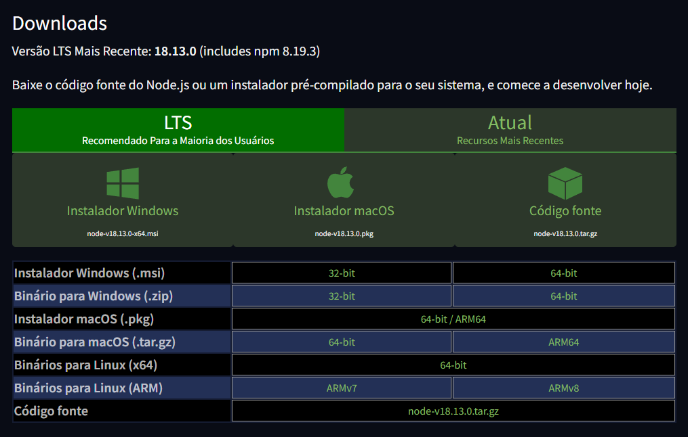
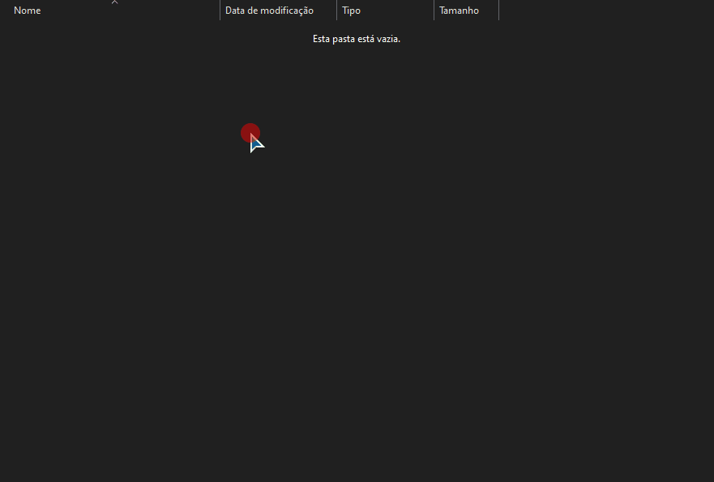
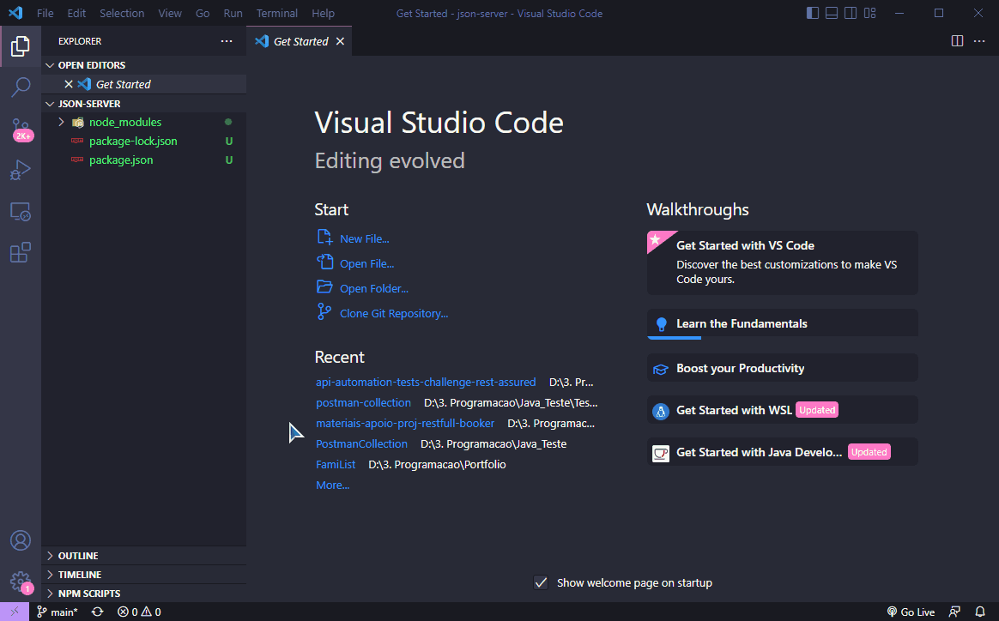
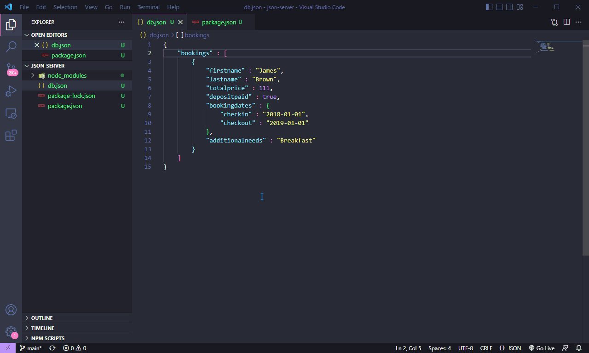
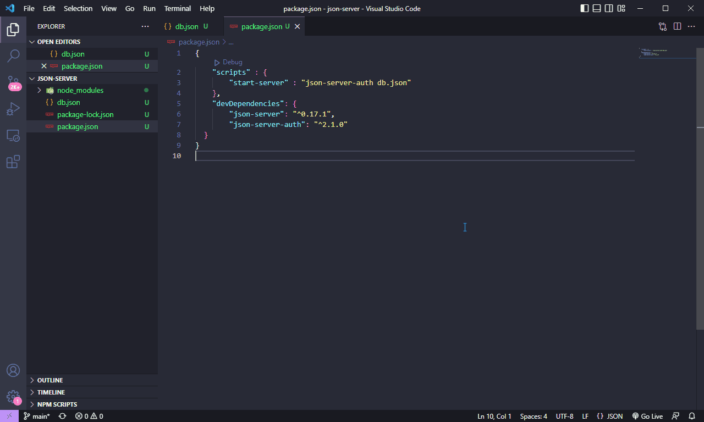
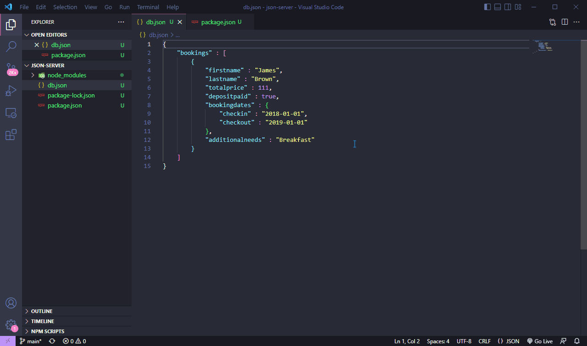
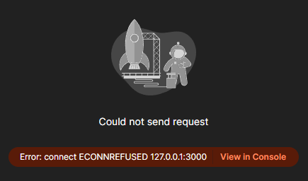
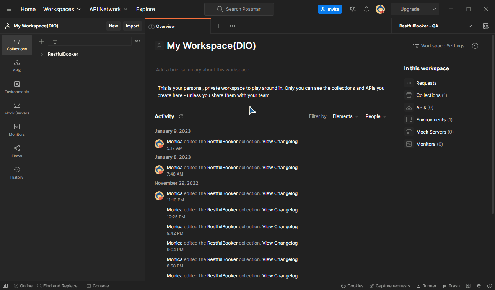
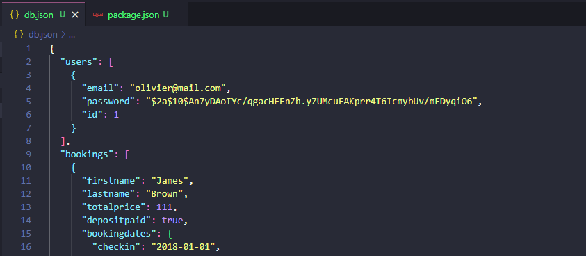

# Indo além com o JSON Server 👩‍💻

Antes de trabalharmos com o JSON Server a gente precisa entender o que ele é e o que deve estar pronto na nossa máquina pra gente seguir com o projeto. O **JSON Server** é um pacote do **npm**. O npm é uma ferramenta do **Node.js**. Logo, o primeiro passo pra nós será baixar e instalar o Node.js.

Saiba mais sobre o Node.js [lendo esse texto](https://www.alura.com.br/artigos/node-js-definicao-caracteristicas-vantagens-usos)!  
&nbsp;  

## 👉 Instalando o Node.js 
&nbsp;  

Acesse o [site do Node.js](https://nodejs.org/pt-br/download/) e escolha o instalador correspondente ao seu sistema operacional:  
&nbsp;  

  
&nbsp;  

Em caso de dúvidas com relação à instalação você também pode ler [esse tutorial](https://kinsta.com/pt/blog/como-instalar-o-node-js/#como-instalar-o-nodejs-e-npm)! Certifique-se de que está tudo certinho, conferindo as versões instaladas, porque agora a gente vai começar a dizer pra essas ferramentas o que fazer!  
&nbsp;  

## 👉 Agora sim iniciaremos com o JSON Server!
&nbsp;  

Uma observação importante é: *o que nós vamos fazer agora é uma **simulação***. Imagine que nós temos a API Restful-booker e nosso cliente pediu por uma **nova funcionalidade** ou por **alterações** nas funcionalidades existentes. Precisamos testar a obtenção e criação de dados dessa nova funcionalidade **antes de ter um back-end pronto**, então precisamos do JSON Server pra criar esse ambiente fictício e continuar nosso projeto em paralelo.  
&nbsp;  

*A seguir eu vou traduzir algumas coisas [desse site aqui](https://www.npmjs.com/package/json-server-auth), o mesmo usado na explicação do projeto.*  
&nbsp;  

Já que nós precisaremos simular autenticações, vamos instalar o json-server-auth junto com o json-server:
```npm
npm install -D json-server json-server-auth
```  

Caso esteja usando o JSON Server pela primeira vez será necessário instalar globalmente também caso vá usar algumas funcionalidades que exigem isso. Leia de novo a [documentação](https://www.npmjs.com/package/json-server-auth) para saber mais.  
&nbsp;  

Eu criei uma pasta específica para essa parte e instalei os pacotes assim:

  
&nbsp;  

Em seguida vamos abrir esse diretório na IDE de sua preferência e criar o arquivo db.json:   
&nbsp;  

  

&nbsp;  

Acabei escrevendo "Booking" com B maiúsculo, o que eu corrigi mais tarde. Também é boa prática que as coleções de informações aqui sempre estejam no plural:
```json
    "bookings" : [
        {
            "firstname" : "James",
            "lastname" : "Brown",
            "totalprice" : 111,
            "depositpaid" : true,
            "bookingdates" : {
                "checkin" : "2018-01-01",
                "checkout" : "2019-01-01"
            },
            "additionalneeds" : "Breakfast"
        }
    ]
```  

Minha ideia pra esse tutorial é acrescentar:
- users collection
    - Login
    - Cadastro
    - Excluir conta  
&nbsp;  

Vamos ao package.json configurar um script para monitorar a nossa database (db.json):
```npm
"start-server" : "json-server-auth db.json" 
```
&nbsp;  

  
&nbsp;  

Se tentarmos rodar esse servidor agora ele gerará endpoints segundo as coleções de informações que nós escrevemos no arquivo db.json que estamos monitorando. Abra o terminal na IDE e digite:

```npm
npm run start-server
```  
&nbsp;  

  


## Parabéns!
Você está rodando o JSON Server com sucesso!  
`✧*｡٩(ˊᗜˋ*)و✧*｡`  
&nbsp;  

## 👉 Acrescentando as novas rotas do projeto  
&nbsp;  

Ok, mais uma vez nós vamos contar muito com nosso amigo Postman. Ainda bem que ele existe e é fácil de entender! Aqui eu vou seguir com o plano de criar a collection "users" para adicionarmos dados cadastrais que serão parte de uma nova funcionalidade que tornará possível que os usuários se cadastrem, façam login e excluam a própria conta se quiserem.
&nbsp;  

  
&nbsp;  

É muito importante que você salve após a criação da collection e rode o server novamente antes de começar a fazer as requisições no Postman ou o mesmo vai apresentar o seguinte erro por não encontrar a collection "users":
&nbsp;  


&nbsp;  

Se você esquecer de rodar o server e tentar fazer requisições também vai receber um erro:
&nbsp;  

  
&nbsp;  

## 👉 Voltando ao meu amado Postman onde tudo era mais simples hahaha
&nbsp;  

Agora é a hora da gente destrinchar o que foi mostrado em aula! Vamos entender de uma vez por todas! Aqui nós estamos fazendo uma requisição do tipo POST, ou seja, iremos criar novos dados para nossa database e eles logo logo aparecerão lá no nosso db.json! Acompanhe comigo o processo:  
&nbsp;  

  
&nbsp;  

### Veja comigo o que foi feito acima:  
&nbsp;  

- Criação de nova variável de ambiente para representar o endereço do nosso servidor local
- Criação de uma nova collection no Postman só pra deixar organizado
- Criação de uma nova requisição cuja funcionalidade é registrar um usuário  
&nbsp;  

Após o sucesso da nossa requisição nossos dados irão aparecer "magicamente" no nosso banco de dados:  
&nbsp;  

  
&nbsp;  

### Algumas dicas:  
&nbsp;  

- Email e senha são indispensáveis nas requisições de tipos **POST**, **PATCH** ou **PUT**;
- Ao criar requisições do tipo **PATCH** ou **DELETE** será preciso passar um parâmetro url na guia "Params" esse parâmetro é o id do usuário que você quer alterar ou excluir;
- No caso de uma requisição do tipo **PATCH** será necessário acrescentar os dados a serem alterados na guia "Body" além do parâmetro url;
- Você pode criar uma requisição de login conforme a documentação do json-server-auth (é exemplificado em aula) usando o endpoint "/login";
- Experimente o "Authorization flow", que foi abordado em aula, mas não nesse tutorial. Procure outras maneiras de se diferenciar.  
&nbsp;  

## 👉 Fim do "indo além"  
&nbsp;  

E foi essa minha trajetória com o JSON Server. Lembre-se que esse é um conteúdo **opcional** do projeto. Eu prefiro dedicar mais tempo às tarefas obrigatórias e as que vão me ajudar na trajetória atual, como estudar os **fundamentos de QA** e o **Syllabus** para ter preparo para a entrevista técnica de Quality Assurance ou mesmo estudar pitch pessoal e formas de ir bem em uma entrevista.

JSON Server definitivamente é uma ferramenta que vamos precisar dominar em algum momento, mas eu não priorizaria agora.

Bom, esse é o final do projeto. Obrigada por ter me acompanhado até aqui!

## 👏