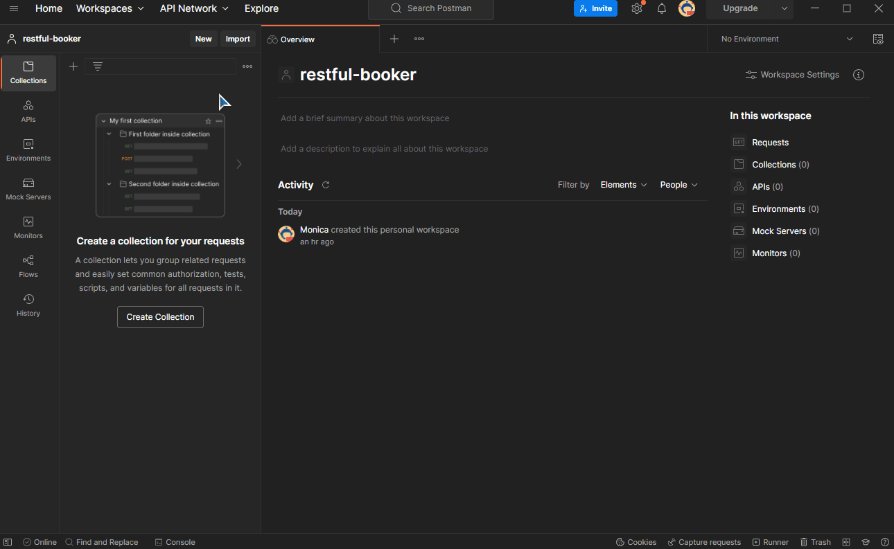
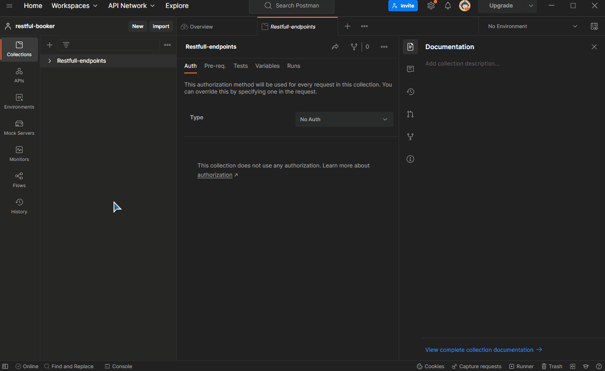
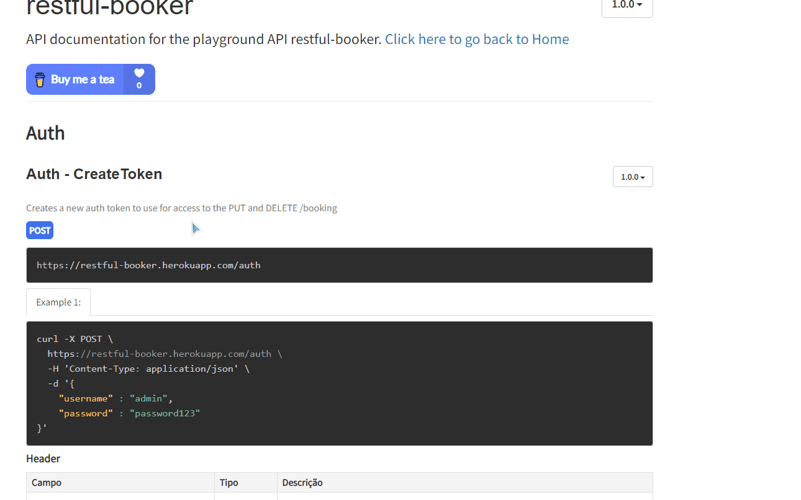
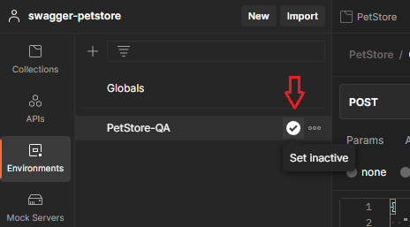
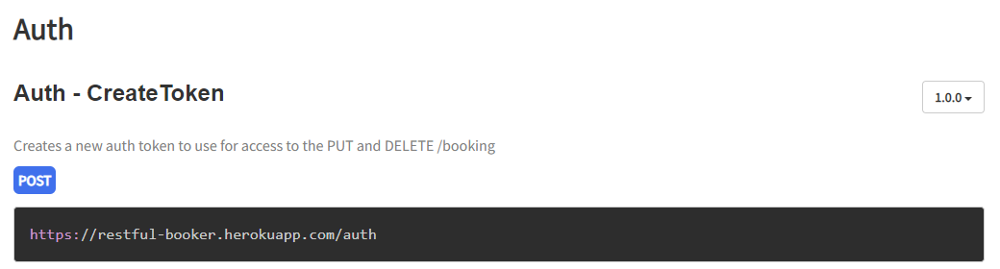
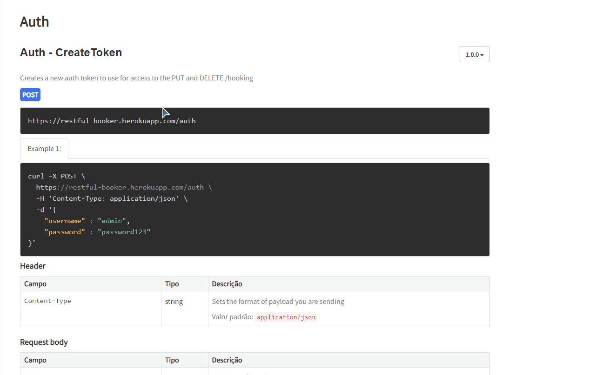
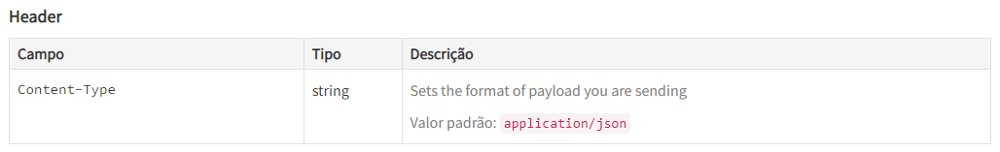
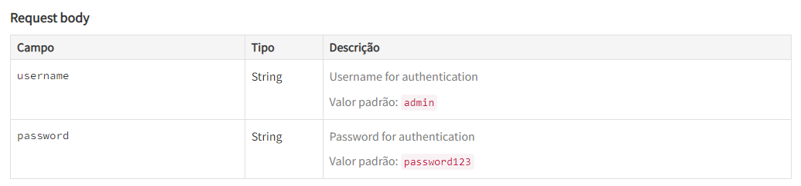

# Criando sua collection no Postman 📧

### 👉 Antes de mais nada, para podermos realizar nossas atividades no Postman precisamos criar um workspace:
---

### 👉 O segundo passo é criarmos uma collection para que seja possível trabalhar os endpoints da API:
---

E o que são endpoints? São os endereços/locais onde nossas solicitações serão realizadas, veja exemplos:
- /auth
- /booking
- /ping

### 👉 O próximo passo é criar um environment. Precisamos dele para criar as variáveis que tornarão o processo mais prático:
---

### 👉 Vamos aproveitar para já criar uma variável para representar a url base da Api, já que iremos utilizá-la múltiplas vezes.
---

Para poder realmente usá-la é necessário ativá-la por meio do símbolo circular com seta

## Ok, já temos mais ou menos uma base! Hora de começar a configurar as requisições!
---
As APIs utilizam **verbos** para definir a finalidade de cada requisição. Eles são:
- GET (ou obter) - Esse tipo de requisição indica uma solicitação de dados, ou seja, serve para **buscar informações**;
- POST (ou publicar) - Tipo de requisição usado para **criar um dado novo**;
- PUT (ou colocar) - Utilizado para **alterar/atualizar** os dados;
- PATCH (ou fragmento) - Utilizado para **alterar apenas parte** dos dados;
- DELETE (ou excluir) - Utilizado para **excluir** um dado.

## Criando um token
---

De início já podemos ver que o tipo dessa requisição é o POST, ou seja, iremos criar uma nova informação!
Apenas depois de gerar esse token poderemos ter acesso às requisições dos tipos **PUT** e **DELETE**.
O processo completo é esse:

- Criamos uma nova requisição usando "Add request" e demos um nome a ela;
- Alteramos o tipo de request para POST conforme informado na página da API;
- Adicionamos a "request URL" usando aquela variável de ambiente que criamos lá no início + o endpoint "/auth";
- Dentro de "Headers" acrescentamos o campo obrigatório "Content-Type" e seu valor padrão;

- E por último, acrescentamos no corpo da nossa requisição as informações obrigatórias de usuário e senha.

*Obs.: Não se esqueça de salvar absolutamente cada passo, pois o Postman pode apresentar erros por estar faltando algo que você já preencheu mas não salvou!*