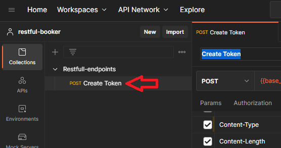
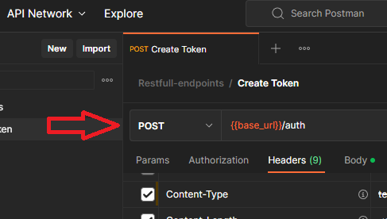
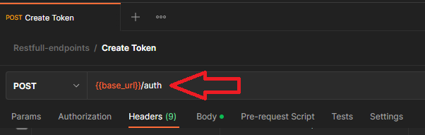
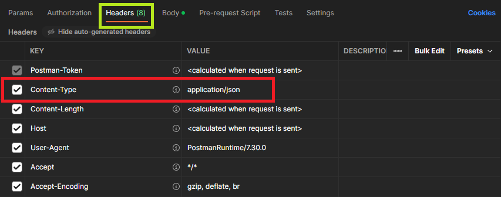
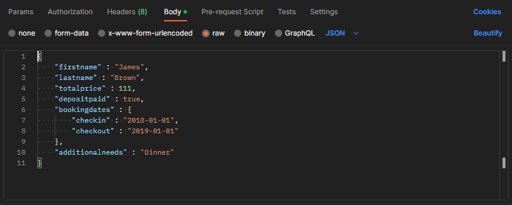
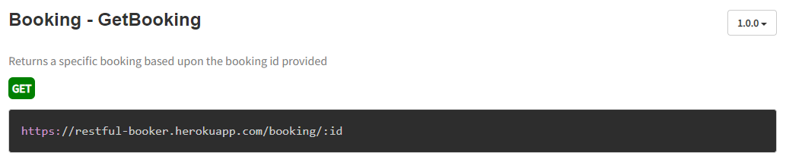
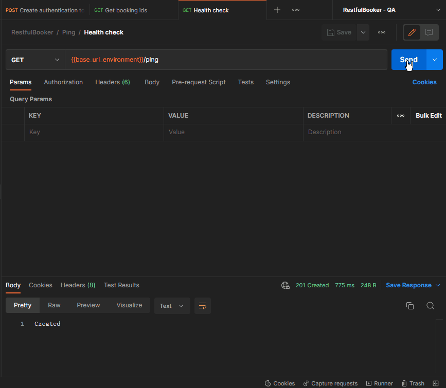
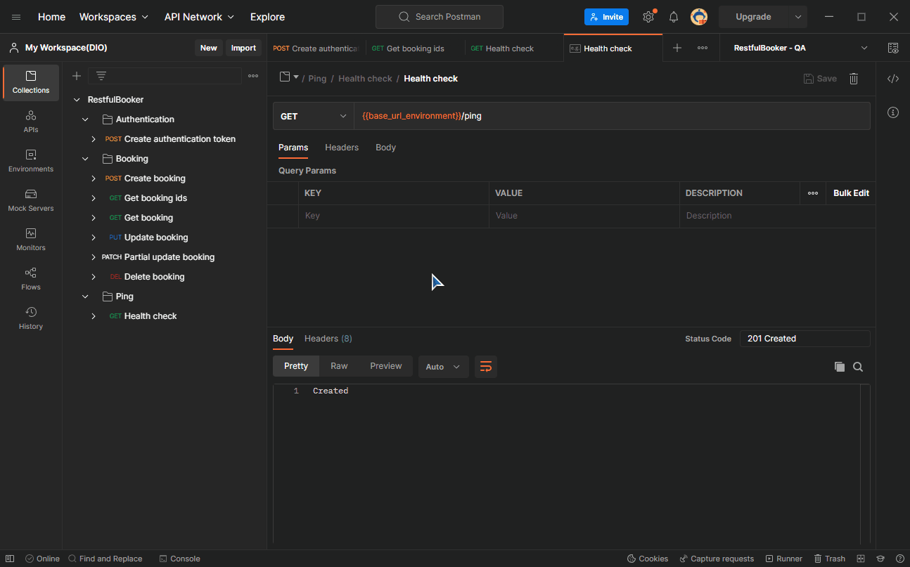

# Criando sua collection no Postman 📧
&nbsp;

### 👉 Antes de mais nada, para podermos realizar nossas atividades no Postman precisamos criar um workspace:
&nbsp;

&nbsp;

### 👉 O segundo passo é criarmos uma collection para que seja possível trabalhar os endpoints da API:
&nbsp;

E o que são endpoints? São os endereços/locais onde nossas solicitações serão realizadas, veja exemplos:
- /auth
- /booking
- /ping

&nbsp;

### 👉 O próximo passo é criar um environment. Precisamos dele para criar as variáveis que tornarão o processo mais prático:
&nbsp;

&nbsp;

### 👉 Vamos aproveitar para já criar uma variável para representar a url base da Api, já que iremos utilizá-la múltiplas vezes.
&nbsp;

&nbsp;

Para poder realmente usá-la é necessário ativá-la por meio do símbolo circular com seta

&nbsp;

&nbsp;

## Ok, já temos mais ou menos uma base! Hora de começar a configurar as requisições!
&nbsp;

As APIs utilizam **verbos** para definir a finalidade de cada requisição. Eles são:
- GET (ou obter) - Esse tipo de requisição indica uma solicitação de dados, ou seja, serve para **buscar informações**;
- POST (ou publicar) - Tipo de requisição usado para **criar um dado novo**;
- PUT (ou colocar) - Utilizado para **alterar/atualizar** os dados;
- PATCH (ou fragmento) - Utilizado para **alterar apenas parte** dos dados;
- DELETE (ou excluir) - Utilizado para **excluir** um dado.

&nbsp;

## Criando um token
&nbsp;

  

De início já podemos ver que o tipo dessa requisição é o POST, ou seja, iremos criar uma nova informação!
Apenas depois de gerar esse token poderemos ter acesso às requisições dos tipos **PUT** e **DELETE**.

&nbsp;

O processo completo é esse:  

&nbsp;

- Criamos uma nova requisição usando "Add request" e demos um nome a ela;  
  

&nbsp;

- Alteramos o tipo de request para POST conforme informado na página da API;  
  

&nbsp;

- Adicionamos a "request URL" usando aquela variável de ambiente que criamos lá no início + o endpoint "/auth";  
  

&nbsp;

- Dentro de "Headers" acrescentamos o campo obrigatório "Content-Type" e seu valor padrão;  
  

&nbsp;

- E por último, acrescentamos no corpo da nossa requisição as informações obrigatórias de usuário e senha.  

*Obs.: Não se esqueça de salvar absolutamente cada passo, pois o Postman pode apresentar erros por estar faltando algo que você já preencheu mas não salvou!*  

&nbsp;

O objetivo desse documento não é te mostrar a resposta, mas sim te ajudar a ler a API e entender como usá-la. Para cada endpoint nós teremos uma série de regras a seguir para que a requisição seja um sucesso:  

  
&nbsp;

Na imagem acima vemos que precisamos incluir o campo "Content-Type" com o valor "application/json" na guia "Headers" da requisição, ou seja:  
&nbsp;

---
&nbsp;

  
&nbsp;

Já no request body acima temos um grupo de parâmetros que precisam ser informados na guia "Body" para a requisição ser efetuada com sucesso. Não é a primeira vez que estamos enviando dados para a criação de uma nova informação na API:  
&nbsp;

  

---
&nbsp;

  
&nbsp;

  
&nbsp;

Quando um parâmetro url é necessário precisamos configurá-lo na guia "Params":  
&nbsp;

  
&nbsp;

Conseguiu configurar todos os seus endpoints? Ótimo! Vamos salvar nossos resultados! (É preciso realizar esse procedimento em todos os endpoints)  
&nbsp;

  
&nbsp;

Sim, você chegou até aqui! Vamos exportar essa collection!  
&nbsp;

  
&nbsp;

Agora que você já exportou sua collection basta acrescentá-la no repositório do seu projeto!  

## 👏