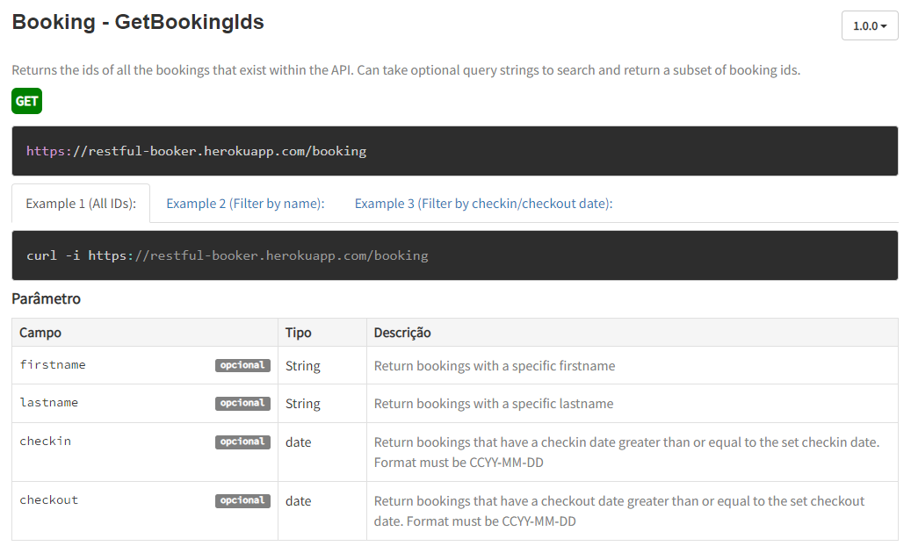
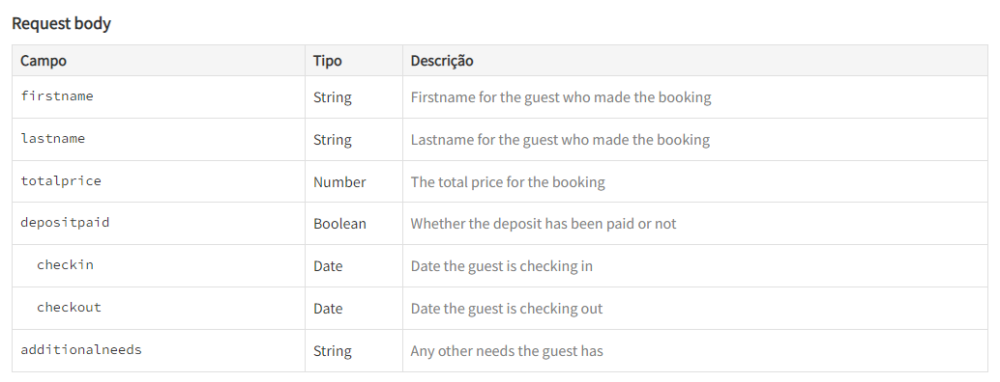
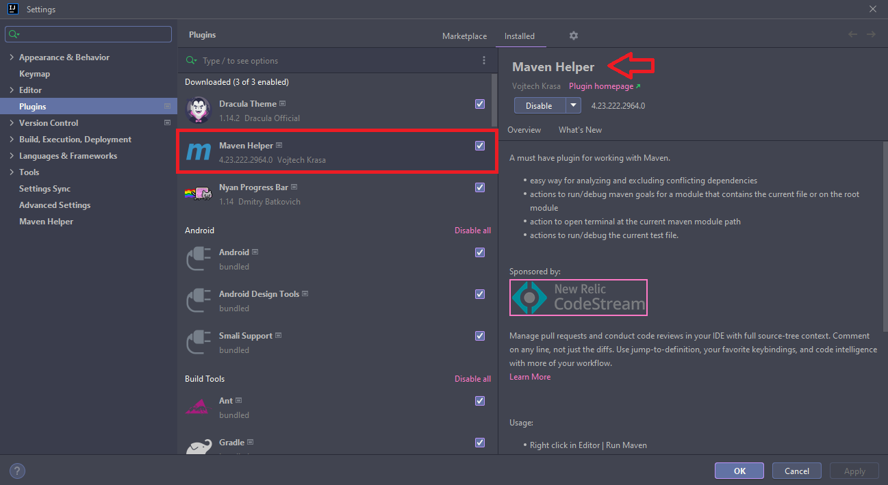
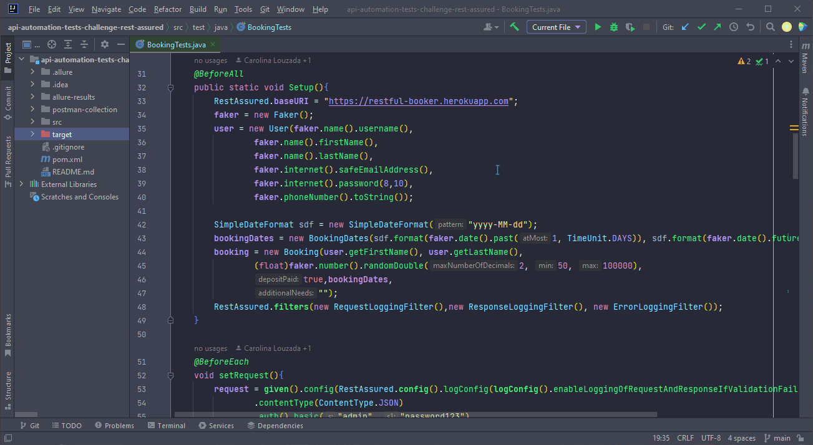

# Criando sua suite de testes 📋  
&nbsp;

Essa é a segunda parte do nosso projeto, focada no Rest Assured, também é obrigatória.

Pra quem não conseguiu pegar essa parte muito bem eu recomendo a seguinte playlist:  
[Semana do Teste de API](https://www.youtube.com/playlist?list=PL-AKz4Dl9nK_WVUY_8FdFb-eTf8ANkYM_)

Além de falar sobre o mercado de QA no vídeo 1, a playlist aborda o Rest Assured com uma didática sensacional nos vídeos seguintes.  

&nbsp;

## Entendendo os testes 🤔
&nbsp;

A Carolina já deu uma base enorme pra gente trabalhar. Nada melhor do que entender o que ela já fez pra gente dar continuidade ao processo!

  

Como podemos ver acima, "GetBookingIds" é uma requisição do tipo GET com 4 parâmetros opcionais.  
&nbsp;  

Abaixo temos um exemplo que pode levar um tempinho pra ser executado, por que ele retorna todos os ids cadastrados na API.  
```java 
    @Test
    public void getAllBookingsById_returnOk(){
        Response response = request
            .when()
                .get("/booking")            // O TIPO DA REQUISIÇÃO É O GET
            .then()
                .extract()
                .response();


        Assertions.assertNotNull(response);
        Assertions.assertEquals(200, response.statusCode());
    }
```

E como isso poderia ser alterado? Acrescentando o parâmetro desejado antes do GET, assim estamos especificando um pouco mais o que deve ser obtido:

```java
    @Test
    public void getAllBookingIds_returnOk(){
        Response response = request
            .when()                                 // QUANDO
                .queryParam("firstName", "José")    // O NOME CADASTRADO FOR JOSÉ
                .get("/booking")                    // OBTENHA A INFORMAÇÃO DO ENDPOINT
            .then()                                 // ENTÃO
                .extract()                          // EXTRAIA
                .response()                         // O RESPONSE BODY
        ;

        Assertions.assertNotNull(response);                     // GARANTA QUE O CAMPO NÃO ESTÁ VAZIO
        Assertions.assertEquals(200, response.statusCode());    // GARANTA QUE O STATUS É O 200 (SUCESSO!)
    }
```
Do mesmo jeito que eu coloquei o "firstname" aqui você pode colocar qualquer outro dos quatro parâmetros opcionais ou até mais de um ao mesmo tempo! E para mais de um parâmetro eu escolhi usar um Hashmap por que esses valores serão sempre os mesmos, veja esse exemplo de criação de token:
```java
    @Test
    public void CreateAuthToken(){
        Map<String, String> body = new HashMap<>();     // CRIANDO UM HASHMAP PARA ENVIAR MAIS DE UM PARÂMETRO
        body.put("username", "admin");
        body.put("password", "password123");

        request
            .header("ContentType", "application/json")
            .when()
                .body(body)                             // INSERINDO O HASHMAP CRIADO
                .post("/auth")                          // O TIPO DA REQUISIÇÃO É O POST
            .then()
                .assertThat()
                .statusCode(200)
            .extract()
                .path("token")
        ; 
    }
```  
Mas, como sempre, existem **melhores práticas**. E a indicação de estudo da Carolina sobre isso é esse artigo:
[Melhor forma de adicionar um request body a uma requisição do tipo POST](https://dev.to/eliasnogueira/the-best-way-to-add-a-request-body-to-a-post-request-using-rest-assured-3onb)  

&nbsp;

---
&nbsp;

## 👉 Estamos praticamente fazendo a mesma coisa que fizemos no postman, seguem os mesmos exemplos:  
&nbsp;

  
&nbsp;

No nosso projeto a inserção do campo "Content-Type" pode ser feita de 2 jeitos:
- `.header("ContentType", "application/json")`
- `.contentType(ContentType.JSON)`  
&nbsp;

---
&nbsp;

  
&nbsp;

Pro caso do request body a Carolina já facilitou e muito a nossa vida, criando uma entity:

```java
    public Booking(String firstName, String lastName, float totalPrice, boolean depositPaid, BookingDates bookingDates, String additionalNeeds) {
        this.firstname = firstName;
        this.lastname = lastName;
        this.totalprice = totalPrice;
        this.depositpaid = depositPaid;
        this.bookingdates = bookingDates;
        this.additionalneeds = additionalNeeds;
    }
```
E setando ela no início do documento de testes:

```java
        bookingDates = new BookingDates("2018-01-02", "2018-01-03");
        booking = new Booking(user.getFirstName(), user.getLastName(),
                (float)faker.number().randomDouble(2, 50, 100000),
                true,bookingDates,
                "");
```
Lembra quando acrescentamos esses parâmetros no postman? Olha como fazemos o mesmo aqui:

```java
            .when()
                .body(booking)      // TODOS AQUELES PARÂMETROS FAZEM PARTE DA ENTITY booking!
                .post("/booking")
```  
&nbsp;

---
&nbsp;

  
&nbsp;

Agora quando um parâmetro url é necessário nós podemos simplesmente acrescentar esse valor diretamente após o endpoint:  
&nbsp;

```java
        request
            .when()
                .get("/booking/7771") // NESSE CASO PODEMOS COLOCAR O ID DIRETAMENTE
```  
&nbsp;

---
&nbsp;

## 👉 Gerando o Allure report 📑  
&nbsp;

Uma vez que a gente já tenha criado um teste para cada endpoint como solicitado, chegou a hora de emitir o allure report.
Eu só consegui gerar o report fazendo exatamente o mesmo procedimento mostrado nas aulas:
- Abrir o projeto no IntelliJ
- Baixar a extensão "Maven Helper"  
&nbsp;

  
&nbsp;

E em seguida siga os passos abaixo:  
&nbsp;

  
&nbsp;

Parabéns, você acabou de gerar o último documento obrigatório desse projeto!  

## 👏